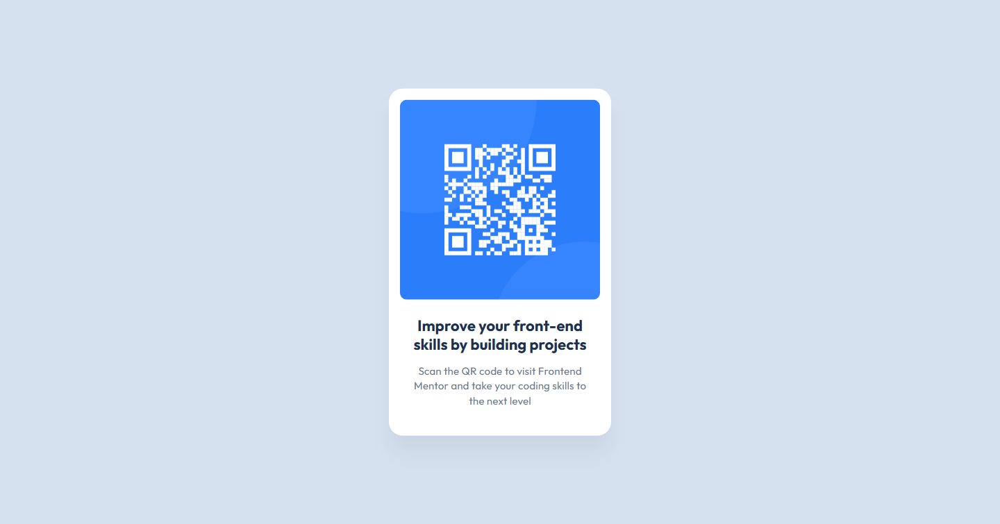

# Frontend Mentor - QR code component solution

This is a solution to the [QR code component challenge on Frontend Mentor](https://www.frontendmentor.io/challenges/qr-code-component-iux_sIO_H). Frontend Mentor challenges help you improve your coding skills by building realistic projects. 

## Table of contents

- [Overview](#overview)
  - [Screenshot](#screenshot)
  - [Links](#links)
- [My process](#my-process)
  - [Built with](#built-with)
  - [What I learned](#what-i-learned)
  - [Continued development](#continued-development)
  - [Useful resources](#useful-resources)
- [Author](#author)
- [Acknowledgments](#acknowledgments)

## Overview

### Screenshots

#### Mobile S - 320px


#### Tablet - 768px


#### Desktop - 1440px



### Links

- [Github Repo](https://github.com/Leondvin/qr-code-component-solution)
- [Live Site URL](https://leondvin.github.io/qr-code-component-solution/)

## My process

### Built with

- Semantic HTML5 markup
- CSS custom properties (variables)
- Flexbox
- External stylesheet

### What I learned

I refreshed my knowledge for centering an element both horizontally and vertically by using the `transform` CSS property.

```css
.card {
    position: absolute;
    left: 50%;
    top: 50%;
    transform: translate(-50%, -50%);
    /* CSS declarations */
}
```

Contributing to the responsiveness of a website by using the `scale` property inside media queries.

```css
@media only screen and (max-width: 64rem) {
    .card {
    transform: translate(-50%, -50%) scale(0.8);
    }
}
@media only screen and (max-width: 48rem) {
    .card {
    transform: translate(-50%, -50%) scale(0.7);
    }
}
@media only screen and (max-width: 20rem) {
    .card {
    transform: translate(-50%, -50%) scale(0.5);
    }
}
```

### Continued development

I would like to further hone my skills on the responsiveness of a page by further experimenting with different media queries, and methods.

### Useful resources

- [Stack Overflow - Center a DIV horizontally and vertically [duplicate]](https://stackoverflow.com/questions/14123999/center-a-div-horizontally-and-vertically) - This helped me with centering the `.card` element both horizontally and vertically, see [What I learned](#what-i-learned).
- [Stack Overflow - Make a DIV and all children elements smaller](https://stackoverflow.com/questions/21122333/make-a-div-and-all-children-elements-smaller) - This helped me with scaling an element both horizontally and vertically, see [What I learned](#what-i-learned).
- I also used the AI assistant on VS Code for debugging the particulars.

## Author

- Github - [@Leondvin](https://github.com/Leondvin)
- Frontend Mentor - [@Leondvin](https://www.frontendmentor.io/profile/Leondvin)
